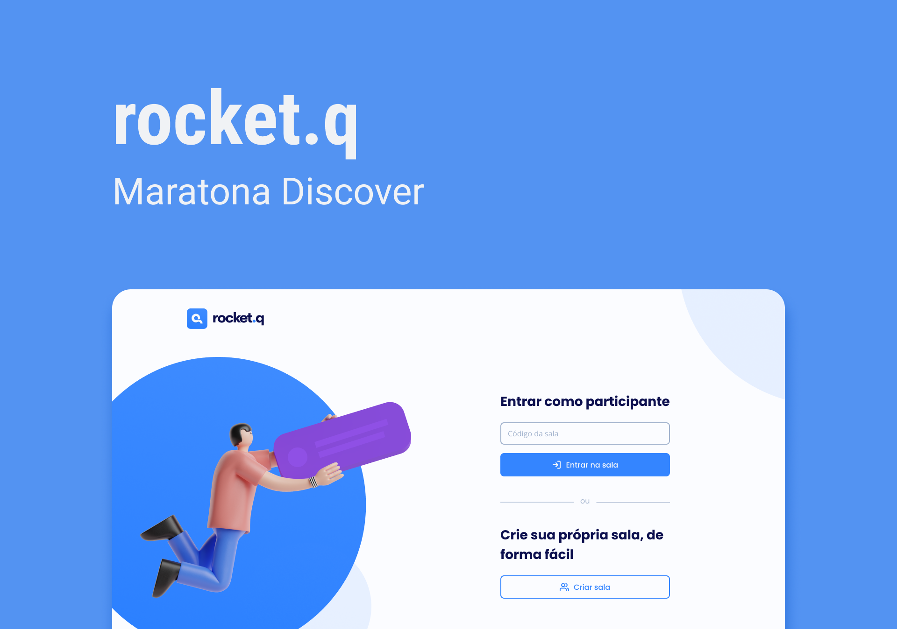

<h1  align="center">

</h1>

<a href="#technologies">Technologies</a>&nbsp;&nbsp;&nbsp;|&nbsp;&nbsp;&nbsp;
<a  href="#project">Project</a>&nbsp;&nbsp;&nbsp;|&nbsp;&nbsp;&nbsp;
<a  href="#layout">Layout</a>

 

<h2 id="technologies">🚀 Technologies</h2>  

This project was developed with the following technologies:

- HTML
- CSS
- JavaScript
- NodeJS
- EJS
- Express
- SQLite

<h2 id="project">💻 Project</h2>  

Rocket.Q is an application of interaction through questions in which you can create a room and receive questions from people. The room's creator can manage the questions marking them as read or deleting them. To mark questions as read or delete is required a password defined by the creator in the creation of the room.

This project was developed during an online coding event, the NLW 6th Edition (Mission Discover), an event organized by [Rocketseat](https://rocketseat.com.br/).
  
<h2 id="layout">✒️ Layout</h2> 

You can see the project's layout in [this link](https://www.figma.com/file/9ok9Dnlt7ISSdawYX9SRdK/Roquet.q-NLW6). It's necessary a [Figma](https://figma.com) account to access.
